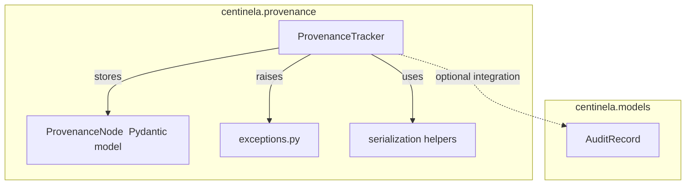

# Design Document: Provenance Tracker

## Overview

The Provenance Tracker provides forensic data lineage for the CENTINELA platform. It maintains a directed acyclic graph (DAG) of artifacts using a pure-Python adjacency list — no external graph library. The design extends the existing stub in `packages/centinela-core/src/centinela/provenance/tracker.py` with: Pydantic v2 data models, cycle detection via DFS reachability, full-subgraph boundary crossing detection, JSON serialization/deserialization, type-based querying, and a structured exception hierarchy.

All code lives in `packages/centinela-core/src/centinela/provenance/` and tests in `packages/centinela-core/tests/provenance/`.

---

## Architecture



The `ProvenanceTracker` is the single public entry point. It owns the graph as two in-memory dicts:

- `_nodes: dict[str, ProvenanceNode]` — keyed by `artifact_id`
- `_children: dict[str, set[str]]` — reverse index: parent → set of child IDs

Maintaining `_children` as a separate index avoids rebuilding it on every `trace_forward` call (the current stub rebuilds it each time).

---

## Components and Interfaces

### `ProvenanceNode` (Pydantic v2 model)

```python
class ProvenanceNode(BaseModel, frozen=True):
    artifact_id: str
    artifact_type: str
    metadata: dict[str, Any] = Field(default_factory=dict)
    parents: list[str] = Field(default_factory=list)
    created_at: datetime = Field(default_factory=lambda: datetime.now(UTC))
```

Frozen so nodes are immutable after creation. `created_at` is always UTC.

### `ProvenanceTracker`

```python
class ProvenanceTracker:
    def add_artifact(
        self,
        artifact_id: str,
        artifact_type: str,
        metadata: dict[str, Any] | None = None,
        parents: list[str] | None = None,
    ) -> ProvenanceNode: ...

    def get_node(self, artifact_id: str) -> ProvenanceNode | None: ...

    def trace_backward(self, artifact_id: str) -> list[ProvenanceNode]: ...

    def trace_forward(self, artifact_id: str) -> list[ProvenanceNode]: ...

    def get_isolation_boundary_crossings(
        self, artifact_id: str, boundary: str
    ) -> list[BoundaryCrossing]: ...

    def get_by_type(self, artifact_type: str) -> list[ProvenanceNode]: ...

    def to_json(self) -> str: ...

    @classmethod
    def from_json(cls, data: str) -> "ProvenanceTracker": ...
```

### `BoundaryCrossing` (Pydantic v2 model)

Replaces the current `dict[str, Any]` return type with a typed model:

```python
class BoundaryCrossing(BaseModel, frozen=True):
    from_node: str
    to_node: str
    from_boundary: Any   # value of the boundary key on the parent
    to_boundary: Any     # value of the boundary key on the child
    boundary_key: str
```

### Exception Hierarchy (`exceptions.py`)

```python
class ProvenanceError(Exception): ...
class DuplicateArtifactError(ProvenanceError): ...
class UnknownParentError(ProvenanceError): ...
class CycleDetectedError(ProvenanceError): ...
class DeserializationError(ProvenanceError): ...
```

---

## Data Models

### In-Memory Graph Representation

```
_nodes: {
    "a1": ProvenanceNode(artifact_id="a1", artifact_type="prompt",  parents=[]),
    "a2": ProvenanceNode(artifact_id="a2", artifact_type="response", parents=["a1"]),
    "a3": ProvenanceNode(artifact_id="a3", artifact_type="eval",     parents=["a2"]),
}

_children: {
    "a1": {"a2"},
    "a2": {"a3"},
    "a3": set(),
}
```

### JSON Serialization Schema

`to_json` produces a JSON object with a single top-level key `"nodes"` — a list of node objects:

```json
{
  "nodes": [
    {
      "artifact_id": "a1",
      "artifact_type": "prompt",
      "metadata": {},
      "parents": [],
      "created_at": "2024-01-15T10:30:00.123456+00:00"
    },
    {
      "artifact_id": "a2",
      "artifact_type": "response",
      "metadata": {"tenant_id": "t1"},
      "parents": ["a1"],
      "created_at": "2024-01-15T10:30:01.456789+00:00"
    }
  ]
}
```

Timestamps are ISO 8601 with UTC offset (`+00:00`). `from_json` reconstructs nodes in list order, so parent references are always satisfied if the serializer emits nodes in topological order (parents before children).

---

## Algorithm Details

### Cycle Detection in `add_artifact`

Before inserting a new node with parents `P`, check whether the new `artifact_id` is already reachable from any node in `P` via the existing graph. If it is, a cycle would be created.

```
def _would_create_cycle(new_id, parents) -> bool:
    # BFS/DFS from each parent; if new_id is reachable, return True
    visited = set()
    stack = list(parents)
    while stack:
        curr = stack.pop()
        if curr == new_id:
            return True
        if curr in visited:
            continue
        visited.add(curr)
        stack.extend(_nodes[curr].parents)  # walk ancestors
    return False
```

This is O(V + E) in the worst case, acceptable for the artifact counts expected in a validation session.

### `trace_backward` — Iterative DFS

Uses an explicit stack to avoid Python recursion limits on deep lineage chains:

```
def trace_backward(artifact_id):
    result, visited, stack = [], set(), [artifact_id]
    while stack:
        curr = stack.pop()
        if curr in visited or curr not in _nodes:
            continue
        visited.add(curr)
        result.append(_nodes[curr])
        stack.extend(_nodes[curr].parents)
    return result
```

### `trace_forward` — Iterative DFS using `_children` index

```
def trace_forward(artifact_id):
    result, visited, stack = [], set(), [artifact_id]
    while stack:
        curr = stack.pop()
        if curr in visited or curr not in _nodes:
            continue
        visited.add(curr)
        result.append(_nodes[curr])
        stack.extend(_children.get(curr, set()))
    return result
```

### Full-Subgraph Boundary Crossing Detection

The current stub only checks direct parents of the queried node. The new implementation walks the full ancestor subgraph (via `trace_backward`) and checks every edge:

```
def get_isolation_boundary_crossings(artifact_id, boundary):
    ancestors = trace_backward(artifact_id)   # includes the node itself
    ancestor_ids = {n.artifact_id for n in ancestors}
    crossings = []
    seen_edges = set()
    for node in ancestors:
        for parent_id in node.parents:
            if parent_id not in ancestor_ids:
                continue
            edge = (parent_id, node.artifact_id)
            if edge in seen_edges:
                continue
            seen_edges.add(edge)
            parent = _nodes[parent_id]
            pv = parent.metadata.get(boundary)   # None if absent
            cv = node.metadata.get(boundary)
            if pv != cv:
                crossings.append(BoundaryCrossing(...))
    return crossings
```

The `seen_edges` set prevents duplicate crossings in diamond-shaped subgraphs.

---

## Correctness Properties

*A property is a characteristic or behavior that should hold true across all valid executions of a system — essentially, a formal statement about what the system should do. Properties serve as the bridge between human-readable specifications and machine-verifiable correctness guarantees.*


### Property 1: Add-then-retrieve round trip

*For any* valid `artifact_id`, `artifact_type`, `metadata`, and `parents` list, after calling `add_artifact`, calling `get_node` with the same `artifact_id` should return a node whose fields exactly match the inputs.

**Validates: Requirements 1.1, 1.2, 8.3**

---

### Property 2: Backward trace completeness and no duplicates

*For any* valid provenance graph and any `artifact_id` in that graph, `trace_backward` should return a set of nodes such that: (a) the queried node is included, (b) every parent of every returned node is also in the returned set (closure), and (c) no node appears more than once (even in diamond-shaped graphs).

**Validates: Requirements 2.1, 2.4**

---

### Property 3: Forward trace completeness and no duplicates

*For any* valid provenance graph and any `artifact_id` in that graph, `trace_forward` should return a set of nodes such that: (a) the queried node is included, (b) every child of every returned node is also in the returned set (closure), and (c) no node appears more than once (even in diamond-shaped graphs).

**Validates: Requirements 3.1, 3.4**

---

### Property 4: Backward/forward trace symmetry

*For any* valid provenance graph and any two nodes A and B, if B appears in `trace_forward(A)` then A must appear in `trace_backward(B)`, and vice versa.

**Validates: Requirements 2.1, 3.1**

---

### Property 5: Cycle detection with atomicity

*For any* valid provenance graph and any attempted `add_artifact` call that would introduce a cycle (direct self-reference or indirect cycle through the existing graph), a `CycleDetectedError` must be raised and the graph must remain byte-for-byte identical to its state before the call.

**Validates: Requirements 1.5, 5.1, 5.2, 5.3**

---

### Property 6: Boundary crossing completeness and deduplication

*For any* valid provenance graph, any `artifact_id`, and any `boundary` key, `get_isolation_boundary_crossings` should return exactly the set of edges in the ancestor subgraph where the parent and child carry different values for that key — with each edge appearing exactly once, regardless of graph shape (including diamonds).

**Validates: Requirements 4.1, 4.4, 4.5**

---

### Property 7: Serialization round trip

*For any* valid provenance graph, calling `to_json` then `from_json` should produce a `ProvenanceTracker` whose graph is structurally and semantically equivalent to the original: same node IDs, same types, same metadata, same parent relationships, and same `created_at` timestamps (to millisecond precision).

**Validates: Requirements 6.1, 6.2, 6.5, 6.6**

---

### Property 8: Type query exactness

*For any* valid provenance graph and any `artifact_type` string, `get_by_type` should return exactly the nodes whose `artifact_type` equals that string (case-sensitive) — no more, no less.

**Validates: Requirements 7.1, 7.3**

---

### Property 9: Graph structural integrity invariant

*For any* sequence of valid `add_artifact` calls, the resulting graph must satisfy: (a) every parent ID referenced by any node exists as a node in the graph, and (b) the graph contains no cycles (it is a DAG).

**Validates: Requirements 8.1, 8.2**

---

## Error Handling

| Situation | Exception | Graph state after |
|---|---|---|
| `add_artifact` with duplicate ID | `DuplicateArtifactError` | Unchanged |
| `add_artifact` with unknown parent | `UnknownParentError` | Unchanged |
| `add_artifact` that would create a cycle | `CycleDetectedError` | Unchanged |
| `from_json` with malformed JSON | `DeserializationError` | N/A (class method) |
| `from_json` with cyclic graph data | `CycleDetectedError` | N/A (class method) |
| `trace_backward` / `trace_forward` with unknown ID | Returns `[]` | Unchanged |
| `get_node` with unknown ID | Returns `None` | Unchanged |
| `get_by_type` with no matches | Returns `[]` | Unchanged |
| `get_isolation_boundary_crossings` with unknown ID | Returns `[]` | Unchanged |

All exceptions inherit from `ProvenanceError` so callers can catch the base class.

---

## Testing Strategy

### Framework

- **Unit tests**: `pytest` in `packages/centinela-core/tests/provenance/`
- **Property-based tests**: `hypothesis` with `@given` decorators
- Minimum **100 iterations** per property test (Hypothesis default is 100; set `max_examples=200` for critical properties)

### Hypothesis Strategies

Custom strategies needed:

```python
# Generate a valid DAG as a list of (artifact_id, artifact_type, metadata, parents) tuples
# where parents always reference earlier entries in the list (topological order)
@st.composite
def dag_strategy(draw):
    ...

# Generate a single valid node spec to add to an existing tracker
@st.composite
def node_spec_strategy(draw):
    ...
```

### Test File Layout

```
packages/centinela-core/tests/provenance/
    __init__.py
    test_tracker_unit.py       # unit tests: specific examples, error conditions, edge cases
    test_tracker_properties.py # property-based tests: one test per design property
```

### Property Test Annotations

Each property test must carry a comment referencing the design property:

```python
# Feature: provenance-tracker, Property 7: Serialization round trip
@given(dag_strategy())
@settings(max_examples=200)
def test_serialization_round_trip(graph_spec):
    ...
```

### Unit Test Coverage

Unit tests focus on:
- Error conditions (duplicate ID, unknown parent, malformed JSON, cyclic JSON)
- Edge cases: empty graph, single-node graph, root node backward trace, leaf node forward trace, missing boundary key
- Specific examples: diamond graph backward/forward trace, multi-hop boundary crossing chain
- `get_by_type` case-sensitivity example

### Property Test Coverage

| Test | Design Property | Hypothesis strategy |
|---|---|---|
| `test_add_retrieve_round_trip` | Property 1 | `node_spec_strategy` |
| `test_backward_trace_completeness` | Property 2 | `dag_strategy` |
| `test_forward_trace_completeness` | Property 3 | `dag_strategy` |
| `test_trace_symmetry` | Property 4 | `dag_strategy` |
| `test_cycle_detection_atomicity` | Property 5 | `dag_strategy` + cycle injection |
| `test_boundary_crossing_completeness` | Property 6 | `dag_strategy` + boundary metadata |
| `test_serialization_round_trip` | Property 7 | `dag_strategy` |
| `test_type_query_exactness` | Property 8 | `dag_strategy` |
| `test_graph_structural_integrity` | Property 9 | `dag_strategy` |
